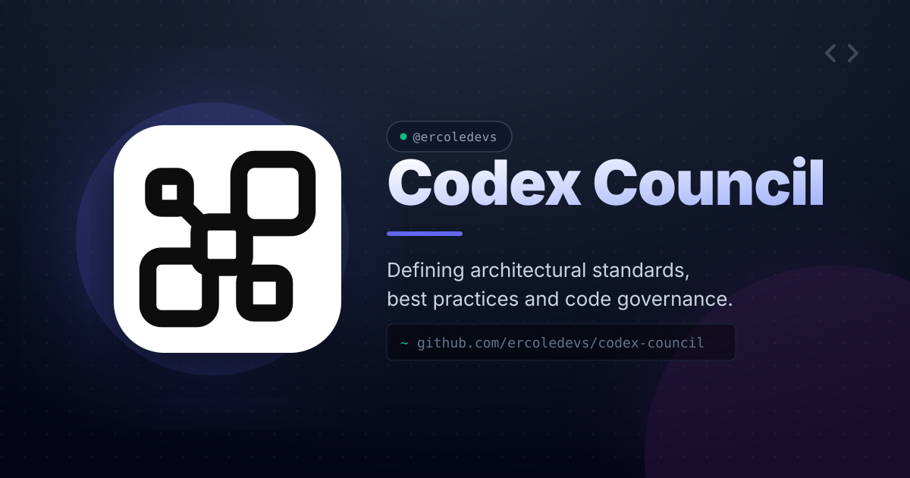

# Codex Council




Codex Council is a Codex plugin for structured multi-agent decision review.

It adapts the LLM Council pattern to a Codex-only workflow: independent first opinions, anonymized peer review, compact scoring, dissent preservation, and a Chairman synthesis.

It does not call third-party model provider APIs by itself. It relies on Codex and optional Codex subagents available in your environment.

## What It Provides

- A Codex skill: `$codex-council`
- Six council roles:
  - Ada Lovelace - Principal Architect
  - Grace Hopper - Reliability Engineer
  - Hypatia - Security and Governance Reviewer
  - Florence Nightingale - Product and Operator Advocate
  - Alan Turing - Contrarian Red Team
  - Seymour Cray - Performance Engineer
- Optional frontend/UX gate:
  - Leonardo da Vinci - Brutally Honest UX/UI Critic
  - Bob - Browser Customer Tester, an evidence runner rather than a voting council member
- Internal competency packs for use without external skills
- Workflow recipes for common review situations
- Governance preflight checklist
- Token-budget guidance
- Token profiles: `compact`, `balanced`, and `expanded`
- Performance impact review for latency, throughput, memory, cost, and scalability
- Deterministic reviewer-score aggregation
- Session scaffolding and validation
- Plugin strict validation

## Install

Install directly from GitHub with the Codex Marketplace CLI:

```bash
npx codex-marketplace add ercoledevs/codex-council --plugin
```

Choose project or global scope when prompted, or pass the scope explicitly:

```bash
npx codex-marketplace add ercoledevs/codex-council --plugin --project
npx codex-marketplace add ercoledevs/codex-council --plugin --global
```

For non-interactive installs:

```bash
npx codex-marketplace add ercoledevs/codex-council --plugin --global -y
```

## Update

If you installed with Codex Marketplace:

```bash
npx codex-marketplace add ercoledevs/codex-council --plugin --global -y
```

For project installs:

```bash
npx codex-marketplace add ercoledevs/codex-council --plugin --project -y
```

Then restart or reload Codex.

## Stay Updated

New versions are announced through GitHub Releases.

To receive update notifications:

1. Open https://github.com/ercoledevs/codex-council
2. Click **Watch**
3. Choose **Custom**
4. Enable **Releases**

You can also check manually:

```bash
python3 scripts/codex_council.py check-update
```

## Manual Install

Clone or copy this repository into your local Codex plugin directory:

```bash
mkdir -p ~/plugins
git clone https://github.com/ercoledevs/codex-council.git ~/plugins/codex-council
```

Add the plugin to your local marketplace file:

```json
{
  "name": "codex-council",
  "source": {
    "source": "local",
    "path": "./plugins/codex-council"
  },
  "policy": {
    "installation": "AVAILABLE",
    "authentication": "ON_INSTALL"
  },
  "category": "Productivity"
}
```

The marketplace file is usually:

```text
~/.agents/plugins/marketplace.json
```

Restart or reload Codex after adding the plugin.

## Usage

Ask Codex to use the council explicitly:

```text
Use $codex-council to review this architecture decision.
```

```text
Council review this implementation plan for blockers, dissent, and verification.
```

```text
Deep Council: review this migration for security, rollback, and data-loss risk.
```

```text
Frontend Council: review this modal flow with Leonardo and have Bob verify browser interaction cases.
```

## Modes

- `fast`: local Chairman review for small, reversible, low-risk decisions
- `standard`: six council members with compact outputs, anonymous review/ranking, performance coverage, and local synthesis
- `deep`: six members plus additional reviewer scrutiny for security, data loss, migrations, irreversible changes, close ties, or explicit full-council requests
- `--frontend-review`: optional flag for UI/UX work; adds Leonardo as UX reviewer and Bob as browser evidence runner
- `--token-budget`: defaults to `compact`; use `balanced` or `expanded` only when blockers, audit, or irreversible risk require more detail

## CLI

The helper script is stdlib-only.

Validate the plugin:

```bash
python3 scripts/codex_council.py validate --plugin-root . --strict
```

Create a traceable council session:

```bash
python3 scripts/codex_council.py init --topic "Architecture Review" --root . --mode standard --token-budget compact
```

Create a frontend/UX session with Leonardo and Bob:

```bash
python3 scripts/codex_council.py init --topic "Frontend Modal Review" --root . --mode standard --token-budget compact --frontend-review
```

Validate a generated session:

```bash
python3 scripts/codex_council.py validate-session --session .codex-council/<session>
```

Aggregate reviewer scores:

```bash
python3 scripts/codex_council.py score --input reviews.json
```

Compact JSON output:

```bash
python3 scripts/codex_council.py score --input reviews.json --compact
```

Check for newer GitHub Releases:

```bash
python3 scripts/codex_council.py check-update
```

Machine-readable update check:

```bash
python3 scripts/codex_council.py check-update --json
```

## Development

Run the test suite:

```bash
python3 -m unittest discover -s tests -v
```

Run strict validation:

```bash
python3 scripts/codex_council.py validate --plugin-root . --strict
```

Before publishing, ensure no local artifacts are present:

```bash
find . -name '.DS_Store' -o -name '._*' -o -name '__pycache__' -o -name '*.pyc'
```

## Structure

```text
codex-council/
├── .codex-plugin/plugin.json
├── assets/
├── scripts/codex_council.py
├── skills/codex-council/SKILL.md
├── skills/codex-council/references/
├── tests/
└── PROVENANCE.md
```

## Important Limits

- Council consensus is not proof.
- This is an advisory workflow, not a legal, security, or compliance approval system.
- Role diversity is produced by isolated Codex role prompts, not by multiple external model providers.
- The original LLM Council pattern uses multiple LLM providers; Codex Council keeps the workflow inside Codex.
- Leonardo and Bob activate only for frontend/UI/UX work. Bob provides browser evidence and does not vote.
- Deep mode should be used for sensitive, irreversible, privacy, security, migration, or data-loss decisions.
- Validate evidence before declaring work complete.

## Provenance

This project is inspired by public LLM Council work:

- https://github.com/karpathy/llm-council
- https://llm-council.dev/

The original pattern asks multiple models for independent answers, anonymizes responses for peer review/ranking, then has a Chairman model synthesize the final answer. Codex Council keeps that decision shape while adapting execution to Codex roles, optional Codex subagents, and local deterministic scoring. See [PROVENANCE.md](PROVENANCE.md) for details.

## License

MIT. See [LICENSE](LICENSE).
